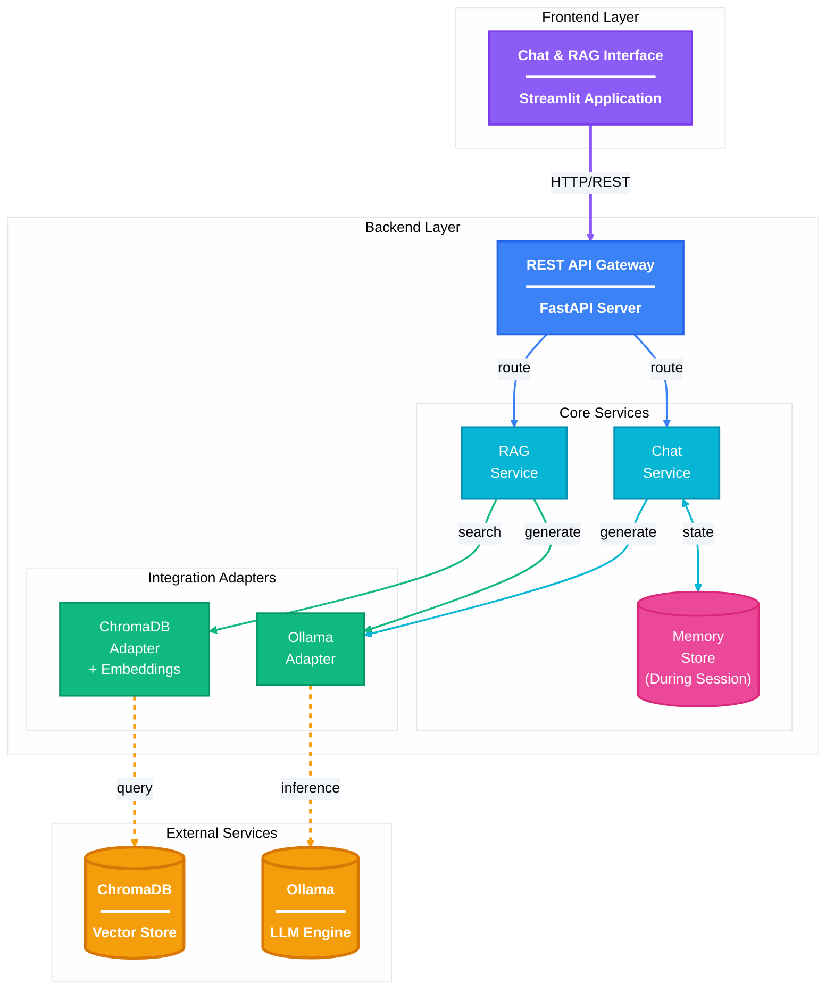

# GenAI RAG Challenge


A production-ready GenAI application featuring a conversational LLM with memory, RAG (Retrieval-Augmented Generation) pipeline for document Q&A, and interactive Streamlit frontend.

## Project Overview

This project implements an end-to-end GenAI solution that:
- Exposes a REST API for LLM chat with conversation memory
- Implements RAG-based Q&A grounded in company documents
- Provides a clean UI to interact with both features
- Runs locally with Ollama or containerized with Docker

## Architecture



### Components

| Component | Technology | Purpose |
|-----------|------------|---------|
| Backend API | FastAPI + Pydantic v2 | REST endpoints with validation |
| Vector Store | ChromaDB | Document embeddings storage |
| Embeddings | sentence-transformers (all-MiniLM-L6-v2) | Text to vector conversion |
| LLM | Ollama (llama3.2:3b) | Response generation |
| Memory | In-memory dict (session-based) | Conversation history |
| Frontend | Streamlit | User interface |
| Package Manager | uv | Fast dependency management |

## Quick Start

### Prerequisites

- Python 3.12+
- [Ollama](https://ollama.ai/) installed and running
- Docker & Docker Compose (for containerized setup)

### Option 1: Docker (Recommended)

One command to run everything:

```bash
# Clone the repository
git clone <repository-url>
cd genai-challenge

# Start Ollama on host (required)
ollama serve
ollama pull llama3.2:3b

# Build and run all services (auto-ingests documents)
make docker
```

Services available at:
- Frontend: http://localhost:8501
- Backend API: http://localhost:8000
- API Docs: http://localhost:8000/docs

### Option 2: Using Make (Local)

```bash
# Full setup: install deps, configure env, ingest docs
make all

# Start Ollama (in a separate terminal)
ollama serve

# Run the backend
make run

# Run the frontend (in another terminal)
make frontend
```

### Option 3: Manual Setup

```bash
# 1. Install uv (if not installed)
curl -LsSf https://astral.sh/uv/install.sh | sh

# 2. Install dependencies
uv sync
uv pip install -e .

# 3. Set up environment
cp .env.example .env

# 4. Start Ollama and pull the model
ollama serve  # In a separate terminal
ollama pull llama3.2:3b

# 5. Ingest documents
uv run python scripts/ingest_documents.py data/documents/

# 6. Run the backend
uv run uvicorn genai_challenge.main:app --app-dir src --reload

# 7. Run the frontend (in another terminal)
uv run streamlit run src/genai_challenge/frontend/app.py
```

## API Endpoints

### Health Check

```bash
curl http://localhost:8000/api/v1/healthcheck
```

Response:
```json
{"status": "healthy"}
```

### Chat with LLM (with Memory)

```bash
# First message - creates a new session
curl -X POST http://localhost:8000/api/v1/chat \
  -H "Content-Type: application/json" \
  -d '{"message": "Hi! My name is Alice."}'
```

Response:
```json
{
  "response": "Hello Alice! How can I help you today?",
  "session_id": "a1b2c3d4-e5f6-7890-abcd-ef1234567890"
}
```

```bash
# Follow-up message - uses same session for memory
curl -X POST http://localhost:8000/api/v1/chat \
  -H "Content-Type: application/json" \
  -d '{
    "message": "What is my name?",
    "session_id": "a1b2c3d4-e5f6-7890-abcd-ef1234567890"
  }'
```

Response:
```json
{
  "response": "Your name is Alice, as you mentioned earlier.",
  "session_id": "a1b2c3d4-e5f6-7890-abcd-ef1234567890"
}
```

### RAG Query (Document Q&A)

```bash
curl -X POST http://localhost:8000/api/v1/rag-query \
  -H "Content-Type: application/json" \
  -d '{"query": "What is the refund policy?", "top_k": 3}'
```

Response:
```json
{
  "answer": "According to ACME's refund policy, customers can request a full refund within 30 days of purchase. After 30 days, refunds are at our discretion and may include a 15% restocking fee. Digital products are non-refundable once downloaded.",
  "sources": [
    {
      "source": "refund_policy.txt",
      "chunk_id": 0,
      "content_preview": "ACME Corporation Refund Policy..."
    }
  ]
}
```

## Project Structure

```
genai-challenge/
├── src/genai_challenge/
│   ├── main.py                 # FastAPI application entry
│   ├── config.py               # Pydantic Settings configuration
│   ├── api/
│   │   ├── routes/
│   │   │   ├── health.py       # GET /healthcheck
│   │   │   ├── chat.py         # POST /chat
│   │   │   └── rag.py          # POST /rag-query
│   │   └── schemas/
│   │       ├── chat.py         # ChatRequest, ChatResponse
│   │       └── rag.py          # RAGRequest, RAGResponse
│   ├── core/
│   │   └── prompts.py          # System prompts and templates
│   ├── services/
│   │   ├── memory.py           # ConversationStore (session memory)
│   │   ├── llm_service.py      # Chat orchestration
│   │   └── rag_service.py      # RAG pipeline orchestration
│   ├── adapters/
│   │   ├── ollama.py           # LangChain ChatOllama wrapper
│   │   └── chroma.py           # ChromaDB vector store wrapper
│   └── frontend/
│       └── app.py              # Streamlit application
├── scripts/
│   ├── ingest_documents.py     # Document ingestion script
│   └── entrypoint.sh           # Docker auto-setup script
├── data/documents/             # Sample ACME documents (11 files)
├── tests/
│   ├── unit/                   # Unit tests (memory, schemas, services)
│   └── integration/            # API integration tests
├── Dockerfile                  # Backend container
├── Dockerfile.frontend         # Frontend container
├── docker-compose.yml          # Multi-container orchestration
├── Makefile                    # Developer commands
├── pyproject.toml              # Dependencies and project config
└── .env.example                # Environment template
```

## Prompt Engineering

### Chat System Prompt

```python
SYSTEM_PROMPT = """You are a helpful assistant for ACME Corporation.
Your role is to answer questions about company policies, procedures, and general inquiries.

Guidelines:
- Be concise and professional
- If you don't know something, say so clearly
- When answering from company documents, cite the relevant section
- Keep responses focused and actionable
"""
```

### RAG System Prompt

```python
RAG_SYSTEM_PROMPT = """You are a helpful assistant for ACME Corporation.
Answer questions based on the provided context from company documents.

Context:
{context}

Guidelines:
- Answer based ONLY on the provided context
- If the context doesn't contain the answer, say "I don't have information about that in the available documents"
- Cite document names when possible
- Be concise and professional

Remember: It's better to say "I don't know" than to make up an answer.
"""
```

### How the Prompts Reduce Hallucinations

| Technique | Implementation | Effect |
|-----------|----------------|--------|
| **Context Boundary** | "Answer based ONLY on the provided context" | Prevents knowledge injection from LLM training |
| **Explicit Refusal** | "say 'I don't have information about that'" | Gives permission to say "I don't know" |
| **Citation Requirement** | "Cite document names when possible" | Forces model to ground answers in sources |
| **Uncertainty Acknowledgment** | "If you're unsure, acknowledge the uncertainty" | Reduces overconfident hallucinations |

### Testing Hallucination Prevention

```bash
# Ask about something NOT in the documents
curl -X POST http://localhost:8000/api/v1/rag-query \
  -H "Content-Type: application/json" \
  -d '{"query": "What is the Mars colonization timeline?"}'

# Expected: "I couldn't find any relevant information in the available documents."
```

## Sample Documents

The project includes 11 sample documents about fictional "ACME Corporation":

| Document | Content |
|----------|---------|
| `company_handbook.txt` | Working hours, leave policies, dress code |
| `refund_policy.txt` | Refund terms, processing times, exceptions |
| `product_guide.txt` | Product features, pricing, system requirements |
| `technical_support.txt` | Contact info, troubleshooting, support tiers |
| `security_policy.txt` | Data protection, passwords, compliance |
| `faq.txt` | Account, billing, and technical FAQs |
| `onboarding_guide.txt` | New employee checklist, benefits, contacts |
| `integration_guide.txt` | API, webhooks, third-party integrations |
| `expense_policy.txt` | Travel, meals, reimbursement procedures |
| `code_of_conduct.txt` | Values, workplace behavior, reporting |
| `release_notes.txt` | Product version history and updates |

## Technology Choices & Justification

| Choice | Justification |
|--------|---------------|
| **Ollama + llama3.2:3b** | Local execution, no API costs, fast inference (~3B params), easy model switching |
| **ChromaDB** | Embedded database, zero server setup, persistent storage, LangChain integration |
| **FastAPI** | Async support, automatic OpenAPI docs, native Pydantic v2 integration |
| **Streamlit** | Rapid UI development, built-in `st.chat_input` for chat interfaces |
| **sentence-transformers** | Open source, runs locally, good semantic quality (all-MiniLM-L6-v2 = 384 dims) |
| **uv** | 10-100x faster than pip, modern lock file, reproducible builds |
| **LangChain (selective)** | Used for ChatOllama and Chroma adapters; avoided for memory (legacy API) |
| **Custom Memory** | Simple dict-based implementation; LangChain's ConversationBufferMemory is deprecated |

## Makefile Commands

```bash
make help        # Show all available commands
make install     # Install dependencies with uv
make setup       # Set up .env and pull Ollama model
make ingest      # Ingest documents into vector store
make run         # Run backend API server
make frontend    # Run Streamlit frontend
make test        # Run all tests (44 tests)
make lint        # Run linter (ruff)
make format      # Format code with ruff
make docker      # Build and run with Docker Compose
make docker-down # Stop Docker services
make clean       # Clean generated files
make all         # Full setup (install, setup, ingest)
```

## Testing

The project includes 44 tests covering:

```bash
# Run all tests
make test

# Run with verbose output
uv run pytest tests/ -v
```

| Test Suite | Coverage |
|------------|----------|
| `test_api.py` | API integration (healthcheck, chat endpoints) |
| `test_memory.py` | Conversation store (isolation, persistence) |
| `test_schemas.py` | Pydantic validation (requests, responses) |
| `test_llm_service.py` | Chat orchestration (mocked LLM) |
| `test_rag_service.py` | RAG pipeline (mocked retrieval) |

## CI/CD

This project uses GitHub Actions for continuous integration:

```yaml
# .github/workflows/ci.yml
on: [push, pull_request] to main branch

Jobs:
- lint: Runs ruff linter on src/ and tests/
- test: Runs pytest with all 44 tests
- docker-build: Verifies Docker image builds successfully
```

The CI pipeline ensures:
- **Code Quality**: All code passes linting rules (ruff)
- **Test Coverage**: All tests pass before merge
- **Build Verification**: Docker image builds correctly

